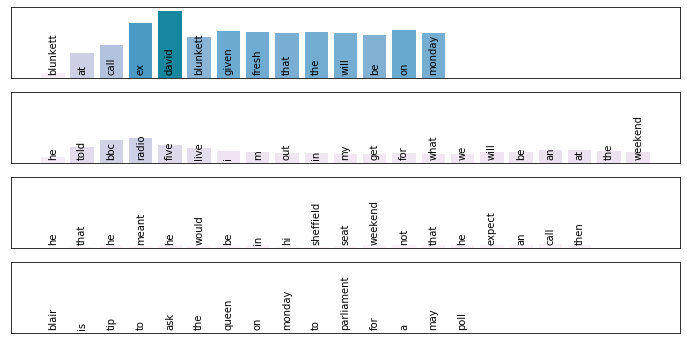
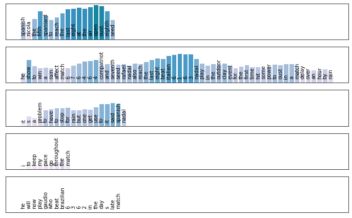

# Hierarchical Attention Network

Attention network for text data, combining word and sentence level attention.

Network structure adapted from  https://github.com/richliao/textClassifier

Also has the ability to extract attention features:

## Structure

- `usage.ipynb`: Usage example, also with plotting utilities
- `attention_layer.py`: Attention layer module for Keras
- `heirachical_attention_network.py`: Network module

## Requirements

- Glove embeddings
- Tensorflow 2.0